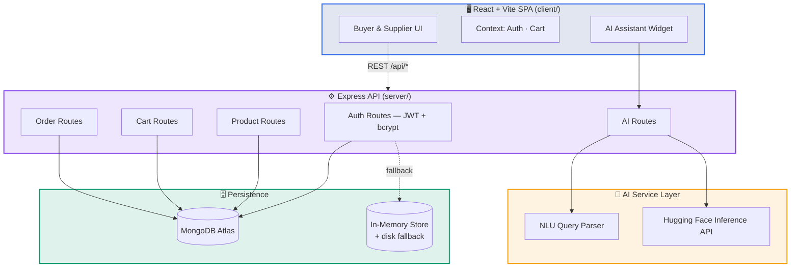
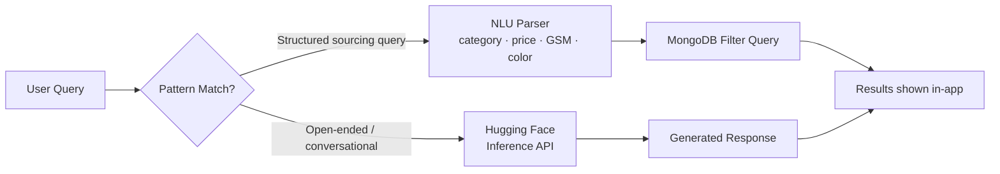

<div align="center">


<br/>

[](https://git.io/typing-svg)

<br/>


<br/><br/>


<br/><br/>

<a href="https://b2-b-textile-marketplace-prototype.vercel.app/"></a>
<a href="https://drive.google.com/file/d/1BAZHVITF1S_MztA0kfQNKrYZFbtBsd85/view?usp=drivesdk"></a>
<a href="#-author"></a>

</div>

<br/>

<div align="center">

### ⚡ Quick Nav

[Overview](#-overview) &nbsp;•&nbsp; [Screenshots](#-screenshots) &nbsp;•&nbsp; [Coverage](#-requirement-coverage) &nbsp;•&nbsp; [Features](#-feature-breakdown) &nbsp;•&nbsp; [Architecture](#-system-architecture) &nbsp;•&nbsp; [Stack](#-tech-stack--why) &nbsp;•&nbsp; [Data Models](#-data-models) &nbsp;•&nbsp; [API](#-api-reference) &nbsp;•&nbsp; [AI Layer](#-ai-layer) &nbsp;•&nbsp; [Security](#-security) &nbsp;•&nbsp; [Setup](#-getting-started) &nbsp;•&nbsp; [Deploy](#-deployment)

</div>

<br/>


## 🎯 Overview

**FabricMart** is a full-stack prototype of a B2B textile marketplace, built to demonstrate how two very different user journeys — a **fabric buyer sourcing material** and a **mill managing inventory & orders** — can share one clean, scalable platform under a single codebase.

Rather than a generic e-commerce template with fabric photos dropped in, the build leans into how textile sourcing actually works: GSM weight, weave construction, composition, MOQ, certifications (OEKO-TEX, GOTS) — and a conversational AI layer that sits on top of real marketplace data rather than replacing the browsing experience.

> 💡 Payments, escrow, and logistics integration are intentionally out of scope for this prototype — the focus is the **discovery → decision → order → fulfillment** workflow end-to-end.

<br/>


## 📸 Screenshots

<div align="center">

<table>
<tr>
<td align="center" width="33%"><b>Marketplace Home</b><br/><sub>_add screenshot_</sub></td>
<td align="center" width="33%"><b>Product Detail & Zoom Audit</b><br/><sub>_add screenshot_</sub></td>
<td align="center" width="33%"><b>Supplier Dashboard</b><br/><sub>_add screenshot_</sub></td>
</tr>
<tr>
<td align="center"><b>AI Sourcing Assistant</b><br/><sub>_add screenshot_</sub></td>
<td align="center"><b>Buyer Onboarding</b><br/><sub>_add screenshot_</sub></td>
<td align="center"><b>Order Pipeline</b><br/><sub>_add screenshot_</sub></td>
</tr>
</table>

</div>

> 📌 **Before sharing this repo, replace the placeholders above** — a reviewer decides whether to keep reading in the first few seconds, and a real screenshot or GIF walkthrough does more work here than any amount of text below it.

<br/>


## ✅ Requirement Coverage

<div align="center"><sub>Direct map from the hackathon brief to what's implemented — for reviewers scanning against the spec.</sub></div>
<br/>

| Requirement | Status | Where |
|---|:---:|---|
| Buyer marketplace discovery (search/filter/categories) | 🟢 | `components/App.jsx`, `routes/products.js` |
| AI conversational assistant (chat, voice, NLU search, comparison, Q&A) | 🟢 | `components/AiAssistant.jsx`, `services/ai.js`, HF Inference API |
| Buyer auth + onboarding | 🟢 | `routes/auth.js`, `components/OnboardingModal.jsx` |
| Shopping cart + mock checkout | 🟢 | `routes/cart.js`, `routes/orders.js`, `CheckoutModal.jsx` |
| Buyer dashboard (orders, status tracking) | 🟢 | `BuyerDashboard.jsx` |
| Supplier onboarding | 🟢 | `OnboardingModal.jsx` (role-aware) |
| Supplier dashboard (widgets) | 🟢 | `SupplierDashboard.jsx` |
| Inventory CRUD + image upload + stock toggle | 🟢 | `routes/products.js`, `SupplierDashboard.jsx` |
| Order management + status pipeline | 🟢 | `routes/orders.js` |
| Role-based access control | 🟢 | JWT `role` claim, route-level checks |
| Responsive / mobile-friendly | 🟢 | Tailwind breakpoints throughout |
| MERN stack | 🟢 | MongoDB · Express · React · Node |
| "Additional creativity" | 🟢 | 3D drape simulation (Three.js), zoom weave-audit lens, AI description generator |
| Payment/escrow/logistics | ⚪ *(explicitly out of scope per brief)* | — |

<br/>


## ✨ Feature Breakdown

<div align="center">

### 🛍️ Buyer Experience

</div>

| Feature | Description |
|---|---|
| 🛍️ **Interactive Catalog** | Search, filter, and sort by category, price, stock, and weave parameters |
| 🔍 **Weave & Fiber Zoom Audit** | Hover magnifier (up to 4.0×) to inspect thread count and yarn detail on product images |
| 🌊 **3D Drape Simulation** | Three.js-powered visualization of fabric drape, wave frequency, and light refraction based on GSM weight |
| 🤖 **AI Conversational Onboarding** | Chat-guided profile builder — business type, procurement volume, category interests, budget |
| 🧠 **AI Sourcing Assistant** | Voice input (Web Speech API), natural-language product search, side-by-side spec comparisons, product Q&A — backed by a Hugging Face-hosted model |
| 🛒 **Wholesale Cart & Checkout** | MOQ warnings, swatch shipping estimates, mock B2B payment terms (Escrow Net 30, L/C, Wire Transfer) |
| 📦 **Order Tracker** | Visual stepper across `Pending → Accepted → Preparing → Ready for Dispatch → Completed` |

<div align="center">

### 🏭 Supplier Experience

</div>

| Feature | Description |
|---|---|
| 📊 **Mill Analytics Dashboard** | Catalog size, active orders, low-stock alerts, revenue pipeline at a glance |
| 🏭 **Guided Onboarding** | Business profile setup — address, fabric lines, MOQ |
| 📝 **Inventory CRUD** | Add, edit, delete listings, upload images, toggle stock status |
| ✍️ **AI Description Generator** | Auto-drafts professional B2B product copy from technical attributes |
| 🚚 **Order Pipeline Management** | Advance incoming purchase orders through prep, packing, and dispatch stages |

<br/>


## 🏗️ System Architecture



<div align="center"><sub>Both buyer and supplier apps are served from the <b>same Express server and origin</b> in production — the built React app is served as static files, with <code>/api/*</code> handled by Express. Single URL, zero CORS configuration.</sub></div>

<br/>


## 💻 Tech Stack & Why

<div align="center">

<table>
<tr><th>Layer</th><th>Technology</th><th>Why</th></tr>
<tr><td>🎨 <b>Frontend</b></td><td>React 18 + Vite</td><td align="left">Fast dev iteration, component reuse across two very different user roles</td></tr>
<tr><td>💅 <b>Styling</b></td><td>Tailwind CSS + custom tokens</td><td align="left">Brand/gold palette, Plus Jakarta Sans + Space Grotesk — on-brand without a heavy component library</td></tr>
<tr><td>🌊 <b>3D/Visual</b></td><td>Three.js</td><td align="left">Fabric drape simulation — genuine differentiation vs. a static product photo</td></tr>
<tr><td>⚙️ <b>Backend</b></td><td>Node.js + Express</td><td align="left">Lightweight REST API, easy to reason about for a time-boxed prototype</td></tr>
<tr><td>🗄️ <b>Database</b></td><td>MongoDB + Mongoose</td><td align="left">Flexible schema for evolving product specs; text index for search</td></tr>
<tr><td>🛡️ <b>Resilience</b></td><td>In-memory store + disk fallback</td><td align="left">App runs instantly with zero external DB setup for local dev/demo</td></tr>
<tr><td>🔐 <b>Auth</b></td><td>JWT + bcrypt</td><td align="left">Stateless auth, industry-standard password hashing</td></tr>
<tr><td>🧠 <b>AI</b></td><td>Hugging Face Inference API</td><td align="left">Real conversational model behind the assistant, not just keyword matching</td></tr>
</table>

</div>

<br/>


## 🗄️ Data Models

| Model | Key Fields |
|---|---|
| **User** | `name`, `email`, `password (bcrypt-hashed)`, `role: buyer \| supplier` |
| **BuyerProfile** | `businessType`, `industry`, `categoriesOfInterest[]`, `preferredFabricTypes[]`, `typicalOrderQuantity`, `budgetRange` |
| **SupplierProfile** | `businessName`, `businessType`, `contactInfo`, `businessAddress`, `operatingHours`, `productCategories[]`, `fabricTypesOffered[]`, `moq` |
| **Product** | `name`, `category`, `description`, `images[]`, `colors[]`, `specifications { gsm, width, composition, weaveType, certifications[] }`, `stockQuantity`, `price`, `moq`, `status` |
| **Cart** | `buyerId`, `items[{ productId, quantity }]` |
| **Order** | `buyerId`, `supplierId`, `items[]`, `totalAmount`, `shippingInfo{}`, `paymentTerms`, `status` (pipeline enum) |
| **ChatLog** | `userId`, `messages[{ sender, text, timestamp }]` |

<sub>Full schema definitions live in <a href="./server/models/schemas.js"><code>server/models/schemas.js</code></a>. Products carry a MongoDB <b>text index</b> across <code>name</code>, <code>description</code>, and <code>category</code> to support both traditional and AI-driven search on the same underlying query layer.</sub>

<br/>


## 🔌 API Reference

<details>
<summary><b>🔑 Auth — <code>/api/auth</code></b></summary>
<br/>

| Method | Endpoint | Description |
|---|---|---|
| `POST` | `/register` | Create a buyer or supplier account (password bcrypt-hashed) |
| `POST` | `/login` | Authenticate and receive a JWT |
| `GET` | `/me` | Get the current user + profile |
| `POST` | `/onboard` | Save onboarding data for a buyer/supplier profile |

</details>

<details>
<summary><b>📦 Products — <code>/api/products</code></b></summary>
<br/>

| Method | Endpoint | Description |
|---|---|---|
| `GET` | `/` | List/search/filter products |
| `GET` | `/:id` | Get a single product |
| `POST` | `/` | Create a product (supplier) |
| `PUT` | `/:id` | Update a product |
| `DELETE` | `/:id` | Remove a product |
| `POST` | `/generate-description` | AI-generated product copy |

</details>

<details>
<summary><b>🛒 Cart — <code>/api/cart</code></b></summary>
<br/>

| Method | Endpoint | Description |
|---|---|---|
| `GET` | `/:buyerId` | Get a buyer's cart |
| `POST` | `/add` | Add an item to the cart |
| `PUT` | `/update` | Update item quantity |
| `DELETE` | `/:buyerId` | Clear the cart |

</details>

<details>
<summary><b>📋 Orders — <code>/api/orders</code></b></summary>
<br/>

| Method | Endpoint | Description |
|---|---|---|
| `POST` | `/checkout` | Place an order from the cart |
| `GET` | `/buyer/:buyerId` | List a buyer's orders |
| `GET` | `/supplier/:supplierId` | List a supplier's incoming orders |
| `PUT` | `/:orderId/status` | Advance an order's pipeline status |

</details>

<details>
<summary><b>🤖 AI Assistant — <code>/api/ai</code></b></summary>
<br/>

| Method | Endpoint | Description |
|---|---|---|
| `POST` | `/chat` | Conversational assistant (search, Q&A, recommendations) — powered by Hugging Face Inference |
| `POST` | `/parse-query` | Parse a natural-language query into structured filters |
| `POST` | `/compare` | Generate a side-by-side comparison of 2–3 products |

</details>

<br/>


## 🧠 AI Layer

The assistant is a two-part system rather than a single black box:



1. **Structured NLU parsing** (`parseNaturalLanguageQuery`) — deterministically extracts category, price ceiling, GSM/weight hints, and color from a query like *"show lightweight cotton denim under $15"*, and turns it into a real MongoDB filter. Fast, free, and predictable for common sourcing-query shapes.
2. **Hugging Face Inference API** (`@huggingface/inference`) — handles open-ended conversation, product Q&A, and recommendations that don't fit a fixed pattern, via `HF_MODEL` (configurable, defaults to a Zephyr instruct model).

🎙️ Voice input runs client-side via the browser's native Web Speech API — no external speech service required.

<br/>


## 🔐 Security

- 🔒 Passwords hashed with **bcrypt** (both the MongoDB-backed path and the in-memory fallback path)
- 🎫 **JWT** with a 7-day expiry, `role` embedded in the token claim for authorization checks
- 🙈 No secrets committed to the repository — `.env` is gitignored on both `client/` and `server/`
- 🛂 Role-based route access separates buyer and supplier capabilities at the API layer, not just the UI

<br/>


## 📁 Project Structure

```
B2B-Textile-Marketplace-Prototype/
├── client/                      # React + Vite frontend
│   ├── src/
│   │   ├── components/          # Navbar, Hero, Dashboards, Modals, AI Assistant, 3D visualizer...
│   │   ├── context/              # AuthContext, CartContext
│   │   ├── App.jsx
│   │   └── main.jsx
│   ├── tailwind.config.js
│   └── vite.config.js
│
├── server/                      # Express backend
│   ├── db/                       # MongoDB connection + in-memory fallback store (disk-persisted)
│   ├── models/                   # Mongoose schemas
│   ├── routes/                   # auth, products, cart, orders, ai
│   ├── services/                 # AI engine (NLU, Hugging Face chat, comparisons, description gen)
│   ├── seed.js                   # Sample supplier/product seed data
│   └── server.js                 # Entry point
│
└── README.md
```

<br/>


## 🚀 Getting Started

### Prerequisites
- Node.js ≥ 18
- npm
- (Optional) A MongoDB connection string — local Mongo or a free [MongoDB Atlas](https://www.mongodb.com/atlas) cluster. Without one, the app runs on a disk-persisted in-memory store automatically.
- (Optional) A [Hugging Face](https://huggingface.co/settings/tokens) API token for the full AI assistant experience.

### 1️⃣ Clone the repo
```bash
git clone https://github.com/vinaybabannavar-create/B2B-Textile-Marketplace-Prototype.git
cd B2B-Textile-Marketplace-Prototype
```

### 2️⃣ Set up the backend
```bash
cd server
npm install
cp .env.example .env     # fill in your values — see Environment Variables below
npm start
```
> Server runs on **`http://localhost:5000`**

### 3️⃣ Set up the frontend
```bash
cd ../client
npm install
npm run dev
```
> Client runs on **`http://localhost:3000`** and proxies `/api` requests to the backend

### 4️⃣ Seed sample data (optional)
```bash
cd ../server
npm run seed
```

<br/>


## 🔐 Environment Variables

Create a `.env` file inside `server/`:

```env
PORT=5000
MONGODB_URI=your-mongodb-connection-string
JWT_SECRET=replace-with-a-long-random-secret
HUGGINGFACE_API_KEY=your-hugging-face-token
HF_MODEL=HuggingFaceH4/zephyr-7b-beta
```

> ⚠️ Always set a real `JWT_SECRET`, `MONGODB_URI`, and `HUGGINGFACE_API_KEY` in production. Without a valid `MONGODB_URI` the app runs on the in-memory fallback store; without `HUGGINGFACE_API_KEY` the AI assistant loses its open-ended conversational ability.

<br/>


## ☁️ Deployment

FabricMart deploys as a **single service**: Express serves the built React app as static files and handles `/api/*` from the same origin.

1. Build the client: `cd client && npm run build`
2. Deploy `server/` (with `client/dist` alongside it) to a Node host — [Render](https://render.com), [Railway](https://railway.app), or similar
3. Set `MONGODB_URI`, `JWT_SECRET`, and `HUGGINGFACE_API_KEY` as environment variables on the host
4. Point a free [MongoDB Atlas](https://www.mongodb.com/atlas) cluster at `MONGODB_URI`
5. Confirm your host's logs show `✅ MongoDB connected successfully` before treating the deployment as demo-ready

<br/>


## 🗺️ Roadmap & Known Limitations

- [ ] Payment gateway integration (out of scope for this prototype by design)
- [ ] Real logistics/delivery tracking integration
- [ ] Admin moderation dashboard
- [ ] Automated test coverage
- [ ] Multi-supplier cart splitting for a single checkout

<br/>

<div align="center">


### 👤 Author

**Vinay** · Final-year CSE Student

<a href="https://github.com/vinaybabannavar-create"></a>
<a href="https://vinay-portfolio-seven-nu.vercel.app"></a>

</div>
